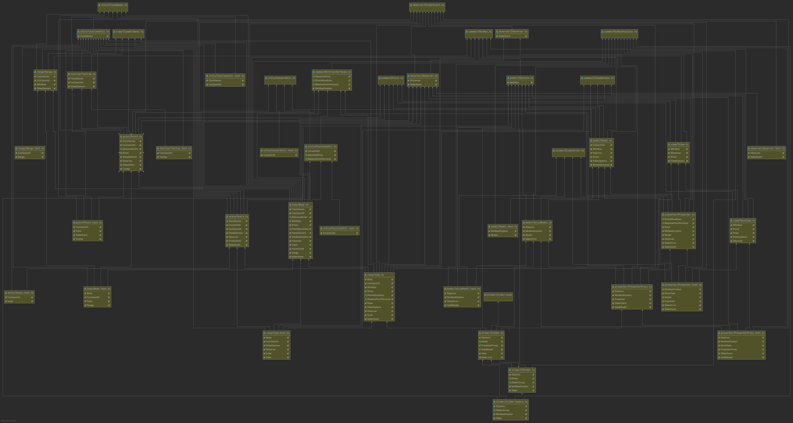
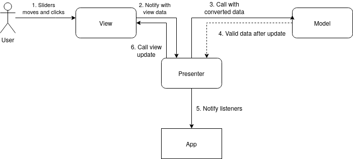

# Slider plugin
Slider plugin with optional jQuery interface for FSD

[Demo](https://bigfatmoon.github.io/Slider/demo/index.html)  
[Coverage](https://bigfatmoon.github.io/Slider/coverage/lcov-report/index.html)

### How to:
##### Install and run project
```
git clone https://github.com/bigfatmoon/Slider.git
npm install
npm run "run prod"
``` 
You can also use any other script in [package.json](./package.json) instead "run prod"

##### Create slider
```javascript
let slider = new Slider("put options here");
slider.init("put element here")
// or
let slider = $("element").slider("options");
```
All options can be found in [IOptions.ts](./src/slider/model/IOptions.ts)  
All supported methods can be found in [ISlider.ts](./src/slider/ISlider.ts)

JQuery support multiple slider and more methods like:
```javascript
$("selector").slider().getElementsQuery().anyQueryFunc();
$("selector").slider().size();
$("selector").slider().getSlider("put index here");
```
#### Understand architecture

Using full generated project diagram



Or with "MVP with Passive View" overview

      
