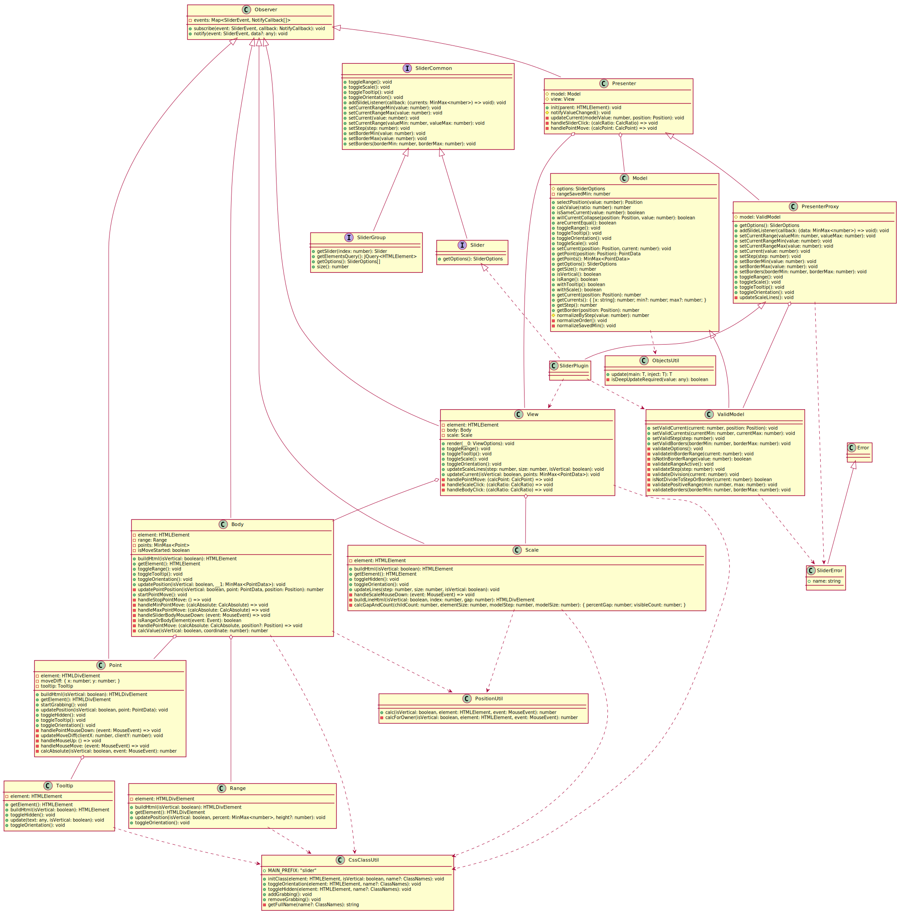

# Slider plugin

Slider plugin with optional jQuery interface for FSD

[Demo](https://bigfatmoon.github.io/Slider/index.html)  
[Coverage](https://bigfatmoon.github.io/Slider/coverage/lcov-report/index.html)

### How to:

##### Install and run project

```
git clone https://github.com/bigfatmoon/Slider.git
npm install
npm run prod
```

You can also use any other script in [package.json](./package.json) instead "prod"

##### Create slider

```javascript
let slider = new SliderPlugin('put options here');
slider.init('put element here');
// or
let slider = $('element').slider('options');
```
Options example:
```javascript
new SliderPlugin({
    current: { min: 10, max: 90 },
    border: { min: 0, max: 100 },
    step: 1,
    isRange: true,
    isVertical: false,
    withTooltip: true,
    withScale: true,
})
```
All options can be found in [SliderOptions](src/slider/support/types.ts)  
All supported methods can be found in [Slider.ts](src/slider/Slider.ts)

JQuery support multiple slider and more methods like:

```javascript
$('selector').slider().getElementsQuery().anyQueryFunc();
$('selector').slider().size();
$('selector').slider().getSlider('put index here');
```

Simple example of plugin injection can be found in [the-simplest-demo dir](./the-simplest-demo)

#### Understand architecture

Using full generated slider class diagram



Or with "MVP with Passive View" overview


And classes brief:

- Slider - main plugin class for connecting MVP components
- Presenter - connect Model and View and call required methods for events
  - PresenterProxy - extends Presenter, contains functions for outer data update
- Model - contain data, provides it according to condition
  - ValidModel - extends Model, contains functions for outer updates validation
- View - render slider components and notify about points move and slider click
- Observer - simplify work with events and callbacks
